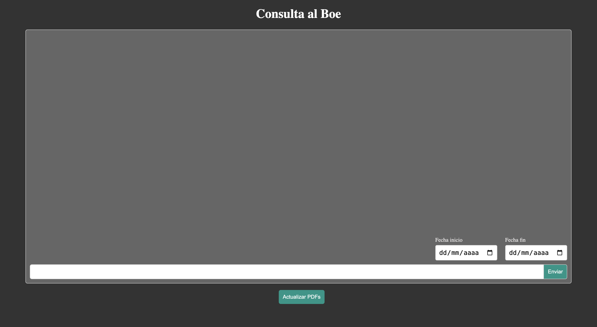
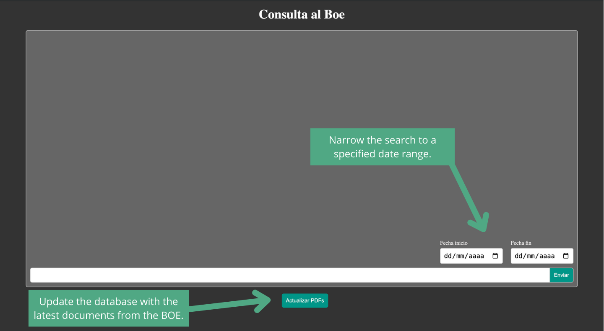

# Proyecto de Consulta Automatizada del BOE

Este proyecto implementa una arquitectura de microservicios para consultar el Boletín Oficial del Estado (BOE) utilizando procesamiento de lenguaje natural. Los servicios están diseñados para interactuar entre sí, proporcionando una solución escalable y eficiente para la búsqueda y consulta de documentos oficiales.



## Índice 
1. [Arquitectura](#arquitectura)
   - [1. BOE-Script](#1-boe-script)
   - [2. Database](#2-database)
   - [3. Embeddings](#3-embeddings)
   - [4. LLM (Large Language Model)](#4-llm-large-language-model)
   - [5. Servidor](#5-servidor)
   - [6. Cliente](#6-cliente)
2. [Instalación y Configuración](#instalación-y-configuración)
   - [Prerrequisitos](#prerrequisitos)
   - [Instalación](#instalación)
   - [Configuración](#configuración)
3. [Uso](#uso)

## Arquitectura

La arquitectura del proyecto se compone de los siguientes microservicios:

### 1. BOE-Script
- **Descripción**: Este servicio es responsable de descargar los archivos PDF del BOE hasta la fecha actual y almacenarlos en una base de datos. Además, guarda los archivos PDF en un directorio local llamado `/pdf`.
- **Tecnología**: Python
- **Funcionalidad**:
  - Descarga los BOEs más recientes.
  - Almacena los PDFs en una base de datos y en el directorio `/pdf`.
- **Endpoints**:
    - GET /update-pdf: comprueba si los pdfs están actualizados. Si no es así, descarga hasta la fecha actual.
    - GET /last-date: Devuelve la fecha del último día descargado.

### 2. Database
- **Descripción**: Este servicio gestiona el almacenamiento y recuperación de los documentos BOE en formato chunk (fragmentos de texto). Recibe los archivos PDF, los divide en chunks, y genera embeddings para su almacenamiento. También permite la consulta de los chunks más relevantes en función de una query y un rango de fechas.
- **Tecnologías**: Python, ChromaDB, LangChain
- **Funcionalidad**:
  - Divide los PDFs en chunks manejables.
  - Genera embeddings para cada chunk y los almacena junto al ID, contenido y fecha.
  - Permite consultas para devolver los 3 chunks más relevantes según la query y el rango de fechas proporcionado.
- **Endpoints**:
    - POST /store: Se encarga de recibir el pdf. Recibe los siguientes parámetros en su cuerpo:
        ```JSON
        {
            "date": "01-01-2024",
            "id": "BOE-A-2024-1",
            "content": "PDF Content"
        }
        ```
    - POST /query: Recibe la pregunta del usuario y las fechas para hacer la consulta. Recibe los siguientes parámetros en su cuerpo:
        ```JSON
        {
            "query": "User question",
            "dateInit": "01-01-2024",
            "dateEnd": "31-01-2024"
        }
        ```

### 3. Embeddings
- **Descripción**: Servicio encargado de recibir los chunks de texto y devolver sus embeddings correspondientes. Los embeddings son vectores numéricos que representan el contenido semántico del texto.
- **Tecnología**: Python, GPT4All
- **Funcionalidad**:
  - Recibe chunks de texto.
  - Genera embeddings correspondientes a cada chunk.

- **Endpoints**: 
    - POST /embeddings: Recibe una cadena de texto para convertirlo en Embeddings. 
        ```JSON
        {
            "content": "Chunk PDF"
        }
        ```
### 4. LLM (Large Language Model)
- **Descripción**: Servicio basado en un modelo de lenguaje grande (LLM) que recibe consultas desde el servidor y genera respuestas utilizando los chunks proporcionados por el servicio de base de datos. El núcleo del servicio es LLaMA 2.
- **Tecnología**: Python, llama-cpp-python, Llama2
- **Funcionalidad**:
  - Recibe queries y los chunks relevantes.
  - Construye respuestas basadas en los chunks.
- **Endpoints**:
    - POST /llama: Solicitud al LLM que contiene el prompt del usuario y el máximo de tokens de la respuesta. La estructura es la siguiente:
        ```JSON
        {
            "system_message": "System Message",
            "user_message": "User Prompt + Chunks",
            "max_tokens": "1024"
        }
        ```
### 5. Servidor
- **Descripción**: Servicio central que coordina la interacción entre el cliente y los otros microservicios. Recibe las consultas del cliente junto con las fechas y se encarga de solicitar los chunks relevantes a la base de datos y generar una respuesta con la ayuda del LLM.
- **Tecnología**: SpringBoot
- **Funcionalidad**:
  - Coordina la comunicación entre el cliente y los servicios de backend.
  - Gestiona las solicitudes de consulta y devuelve respuestas al cliente.
- **Endpoints**: 
    - POST /llama: Solicitud que contiene la pregunta del usuario y el rango de fechas proporcionado. La estructura es la siguiente: 
        ```JSON
            {
                "message": "User Message",
                "dateStart": "Initial Date",
                "dateEnd": "End Date"
            }
        ```

### 6. Cliente
- **Descripción**: Interfaz de usuario que permite a los usuarios interactuar con el sistema a través de un chat. Los usuarios pueden realizar consultas sobre el BOE.
- **Tecnologías**: React, NextJS
- **Funcionalidad**:
  - Proporciona una interfaz de chat para que los usuarios puedan hacer preguntas.
  - Envía las consultas y fechas al servidor para obtener respuestas relevantes.

## Instalación y Configuración

Para desplegar este proyecto, sigue estos pasos:

### Prerrequisitos
- **Docker**

### Instalación

1. **Clonar el repositorio**:
    ```bash
    git clone https://github.com/tuusuario/boe-consulta-automatizada.git
    cd boe-consulta-automatizada
    ```

3. **Construir Docker Compose**:
    - **Construir los contenedores**:
        ```bash
        cd HPE-CDS-LLM
        docker compose build -no-cache
        ```
    - **Correr el Docker Compose**:
        ```bash
        docker compose up
        ```


## Uso

1. **Iniciar los microservicios**: Asegúrate de que todos los microservicios estén en funcionamiento.
2. **Acceder al cliente**: Abre el navegador y navega a `http://localhost:3000`.
3. **Consultar el BOE**: Usa la interfaz de chat para realizar consultas sobre el BOE. El sistema procesará la consulta y devolverá los resultados más relevantes. Incluye las siguientes funcionalidades:
    - Actualizar la base de datos con los últimos BOEs.
    - Configurar el rango de fechas de la consulta.

